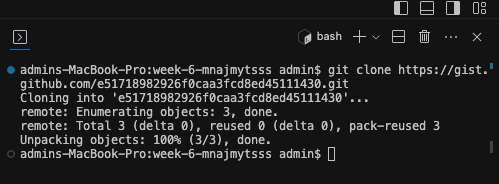
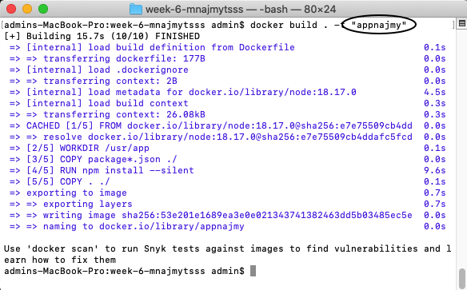

# Assignment Week 6

## Docker

Docker is a software platform that allows you to quickly build, test and deploy applications. Docker packages software into standardized units called containers that have everything the software needs to function including libraries, system tools, code, and runtime. Using Docker, you can quickly deploy and scale applications to any environment and be confident that your code will run.

## Assignment Purpose:

To understand Docker concepts and able to containerize a Node.js application effectively.

## Getting Started :

#### Install Docker :

1. Visit [Docker Website](https://www.docker.com/)

2. Download according to your operating system
   
   

3. You can register and login your docker account.

4. And finally to make sure your docker is installed properly, you can check on your terminal by using the command `docker -v`
   
   
   
   

#### Create a Node.js Project

1. Here I use the node.js project that has been provided by Revou which I cloned from the following [link](https://gist.github.com/berdoezt/e51718982926f0caa3fcd8ed45111430)
   
   

2. Clone it in the repository that you have created for this assignment
   
   

3. Create `package.json` file on the same working directory
   
> {
> "main": "app.js",
>
> "scripts": {
>
> "start": "node app.js"
>
> },
>
> "dependencies": {
>
> "express": "^4.18.2"
> }
> }

#### Dockerizing

1. Create `Dockerfile` on your node project directory
   
> {
> #Use the official node Image as the base images
> FROM node:18.17.0
>
> #set the working directory inside the container
> WORKDIR /usr/app
>
> #copy all the package.json in to the contianer
> #run node inside the container
> COPY package*.json ./
> RUN npm install --silent
>
> #copy all file inside the container
> COPY . ./
>
> #expose the port that the application listen on
> EXPOSE 3002
>
> #command to run the node application
> CMD [ "node", "app.js" ]
> }

2. Open terminal on the same project directory.
   
   To build the Docker image run this command: `docker build -t my-node-app .` *note: my-node-app is the image name, so you can customize it*
   
   for example i named it as `appnajmy` and then click enter, wait until the build process finish.
   
   
   
   
   
   
